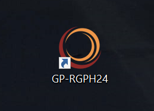
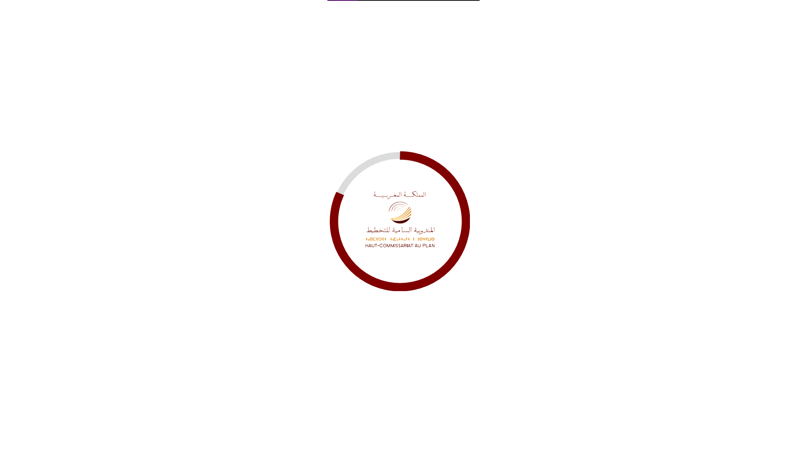
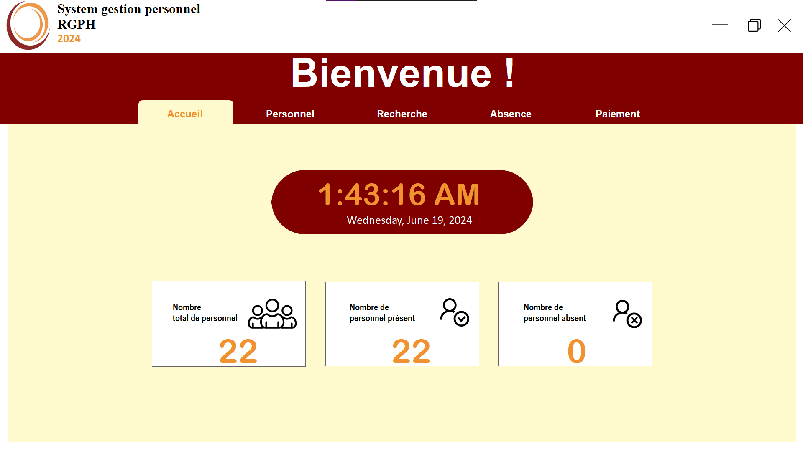
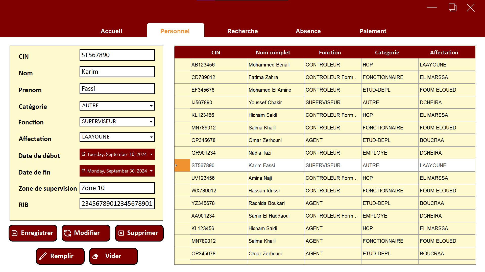
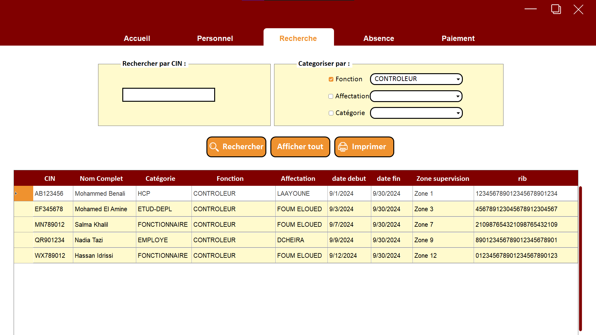
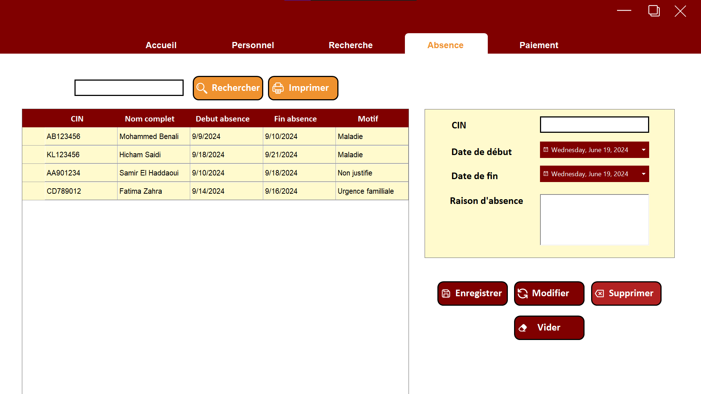
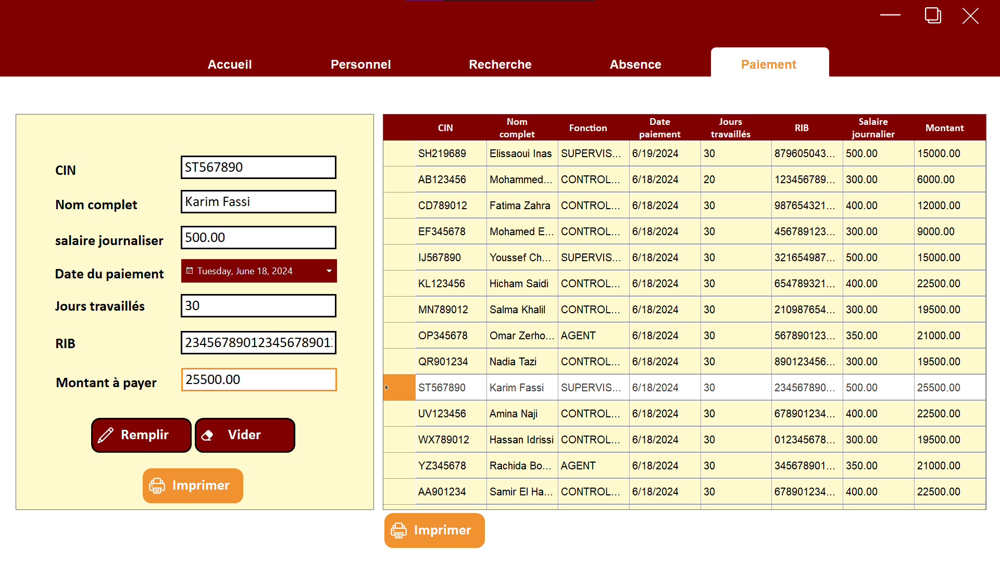
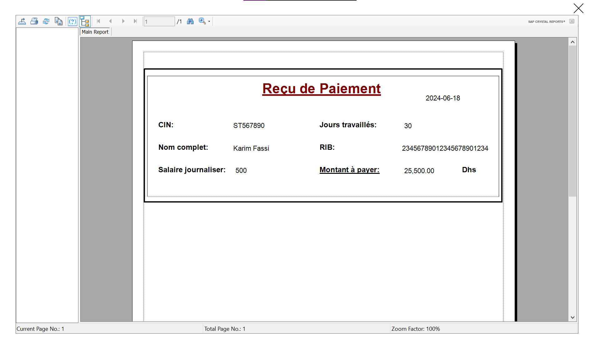
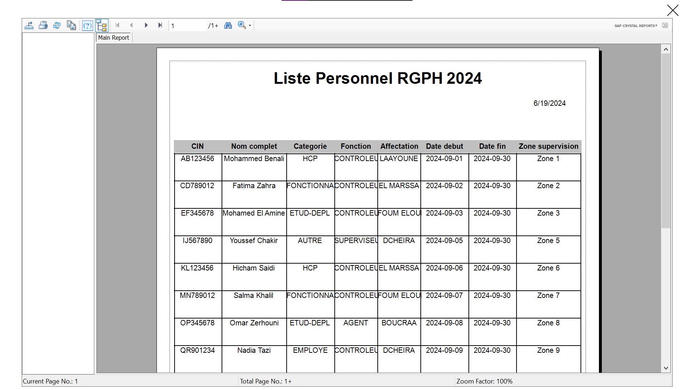

# Personnel Management System

A comprehensive desktop application developed in **C#** using **Microsoft Visual Studio**, **Microsoft SQL Server**, **Crystal Reports**, **Bunifu**, and **Guna UI Framework**. This system is designed to efficiently manage employee records, offering a user-friendly interface and robust reporting capabilities for human resource management.

---

## 🚀 Features

- **Employee Management**: Add, edit, and delete employee records.
- **Attendance Tracking**: Monitor and manage employee attendance; generate attendance reports.
- **Payroll Management**: Automatically calculate and manage employee salaries.
- **Crystal Reports Integration**: Generate detailed and professional reports for various HR metrics.
- **Modern UI**: Sleek and responsive interface using **Bunifu** and **Guna UI Frameworks**.

---

## 🛠️ Technologies Used

- **C#** – Core programming language
- **Microsoft SQL Server** – Backend database management system
- **Crystal Reports** – Reporting tool for generating custom HR reports
- **Bunifu UI** – UI framework for a modern and interactive user experience
- **Guna UI Framework** – Advanced controls and animations for enhanced UI
- **Microsoft Visual Studio** – Integrated Development Environment (IDE)

---

## 📸 Screenshots

<table>
  <tr>
    <td></td>
    <td></td>
  </tr>
  <tr>
    <td></td>
    <td></td>
  </tr>
  <tr>
    <td></td>
    <td></td>
  </tr>
  <tr>
    <td></td>
    <td></td>
  </tr>
  <tr>
    <td></td>
    <td></td>
  </tr>
</table>

---

### 📋 Prerequisites

- **Microsoft Visual Studio**
- **Microsoft SQL Server**
- **Crystal Reports**
- **Bunifu UI Framework**
- **Guna UI Framework**

